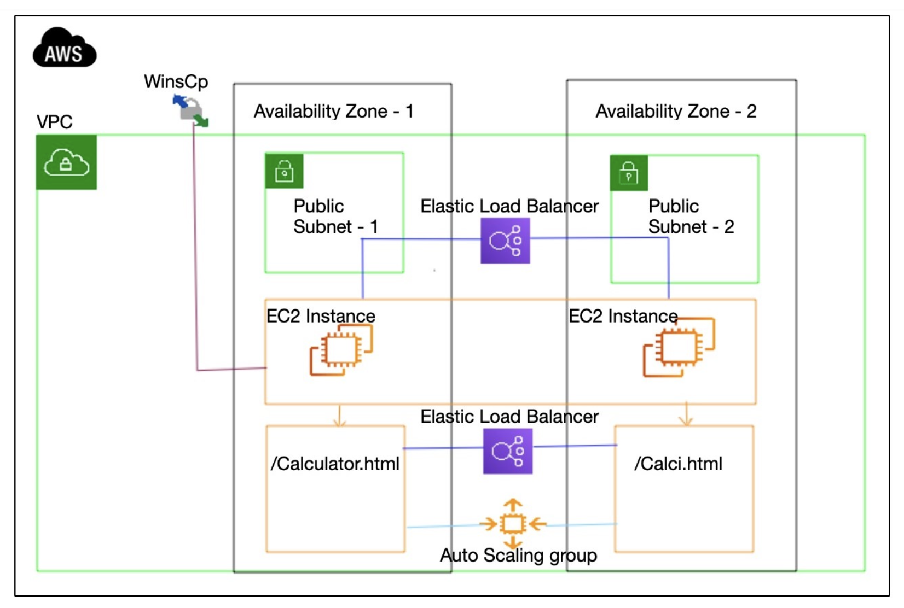

# Building and Hosting a Web-Based Calculator Using AWS

## Overview
This project demonstrates how to build and deploy a web-based calculator on AWS using EC2 instances, Elastic Load Balancers, Auto Scaling, and a Virtual Private Cloud (VPC). The architecture ensures high availability and scalability.

## Architecture Diagram


## AWS Services Used
- **VPC (Virtual Private Cloud)**: Provides network isolation.
- **EC2 Instances**: Hosts the web-based calculator.
- **Elastic Load Balancer (ELB)**: Distributes incoming traffic across multiple EC2 instances.
- **Auto Scaling Group**: Ensures scalability and reliability.
- **Public Subnets**: Hosts the EC2 instances within different Availability Zones.

## Steps to Deploy

### 1. Set Up AWS Environment
- Create a VPC and define subnets.
- Set up security groups and IAM roles.

### 2. Launch EC2 Instances
- Deploy EC2 instances in multiple Availability Zones.
- Install necessary dependencies (Apache, Node.js, or any required framework).

### 3. Configure Load Balancer
- Create an Elastic Load Balancer (ELB) and register EC2 instances.

### 4. Implement Auto Scaling
- Set up an Auto Scaling group to maintain instance availability.

### 5. Deploy the Calculator Web App
- Upload calculator files (`Calculator.html`, `Calci.html`) to EC2 instances.
- Configure routing and health checks.

### 6. Access the Application
- Use the public DNS or load balancer URL to access the calculator.

## Deployment Commands
```sh
# Install Apache on EC2
sudo yum update -y
